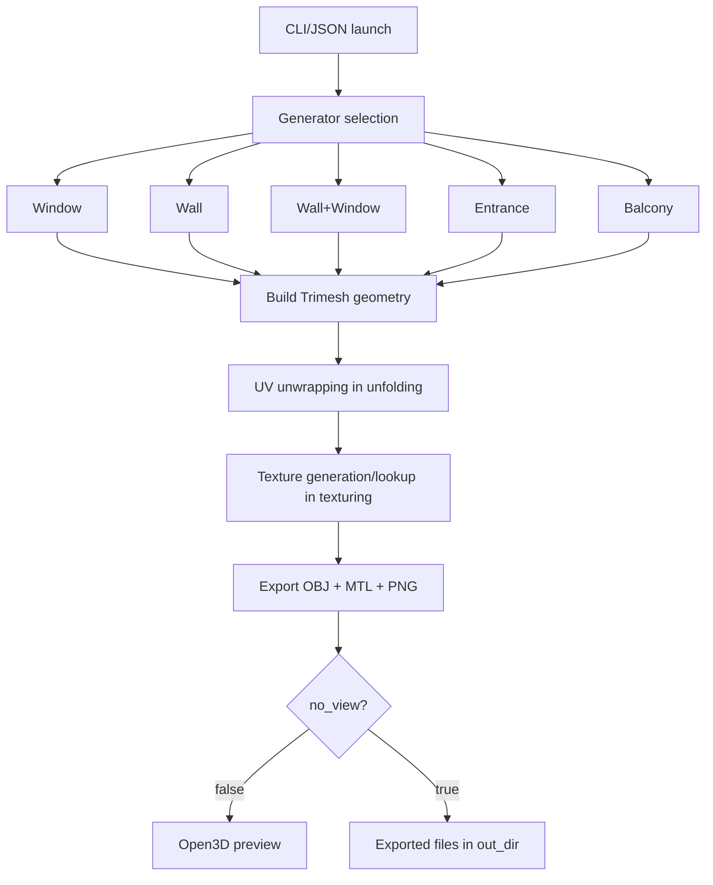
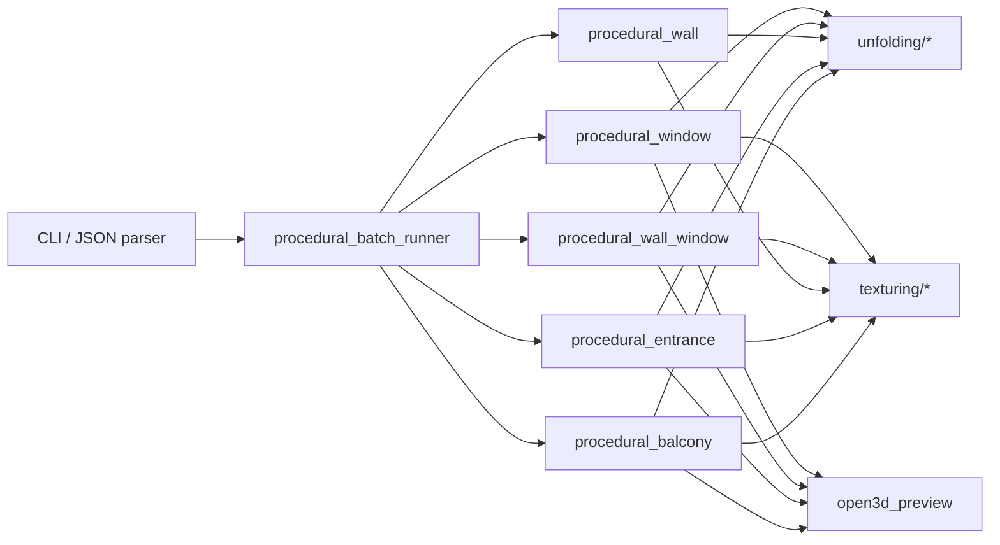
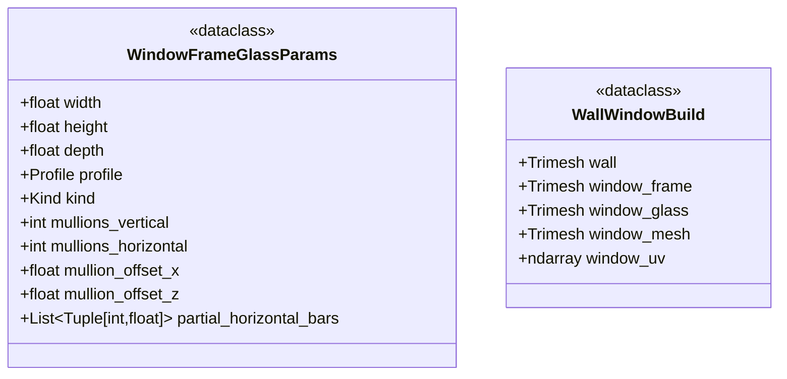
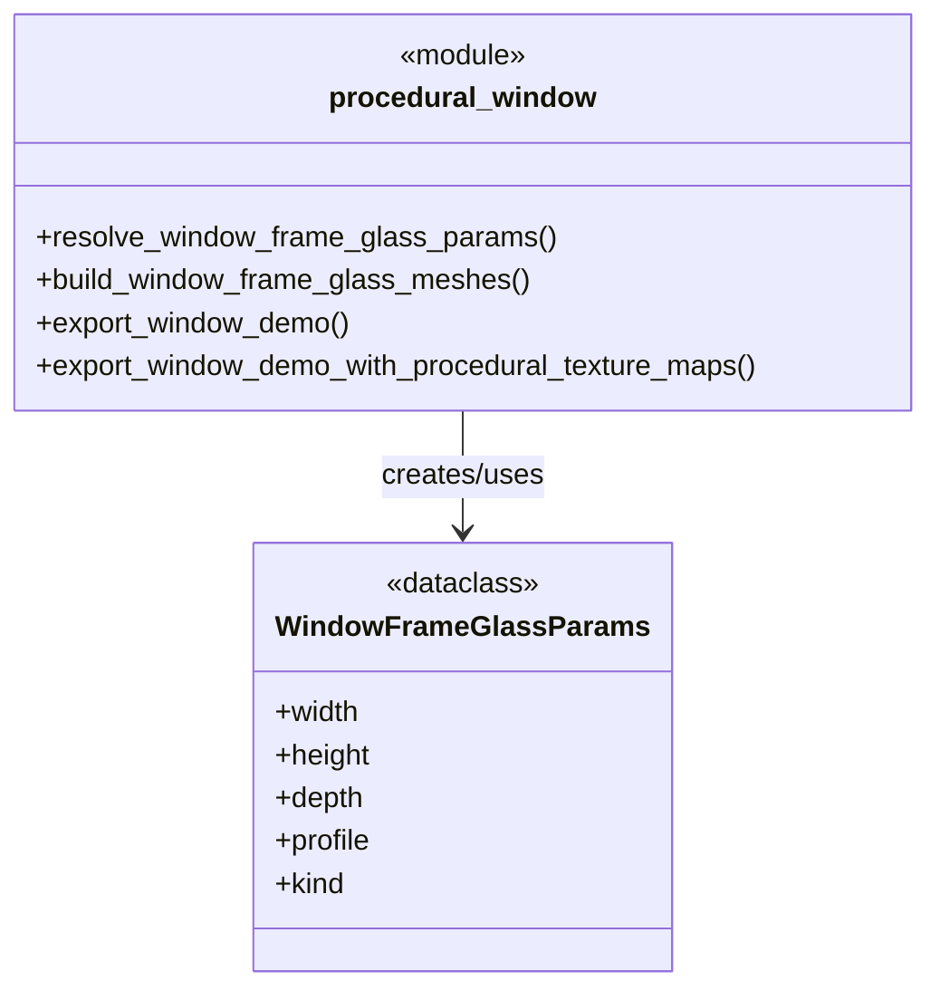
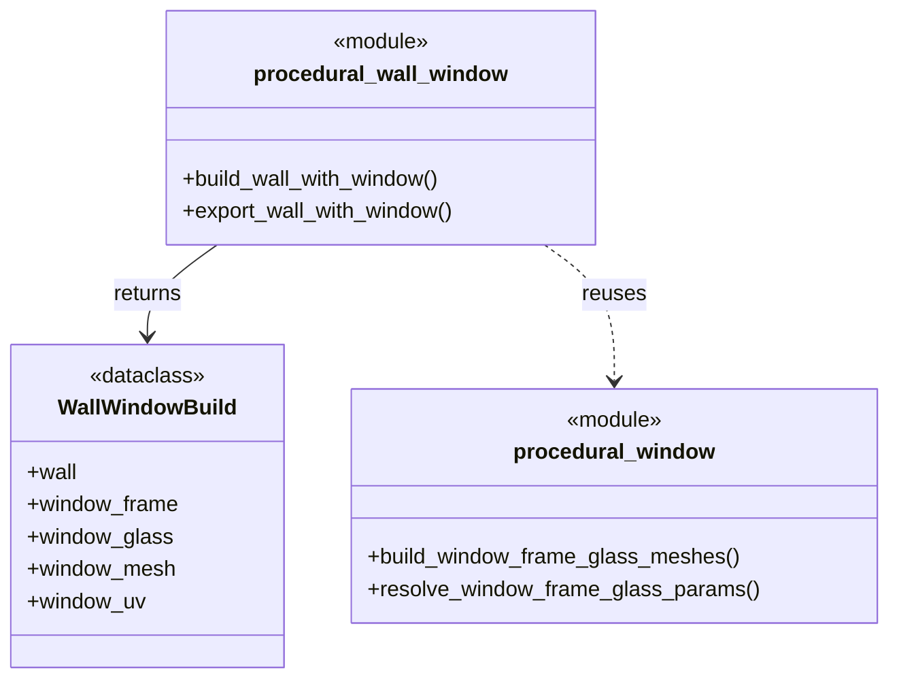
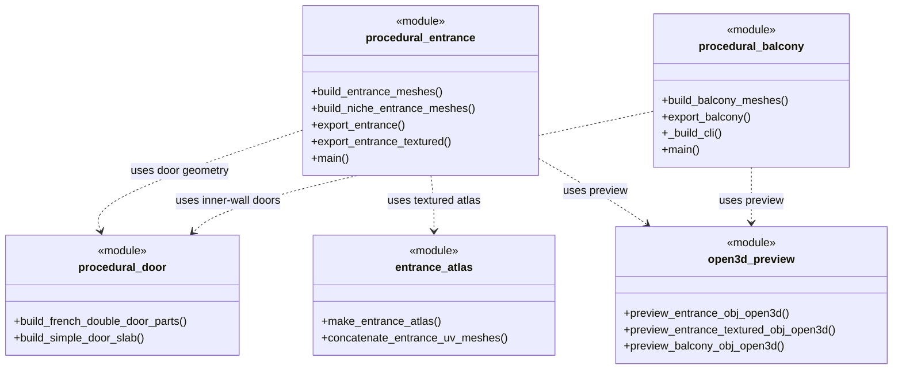
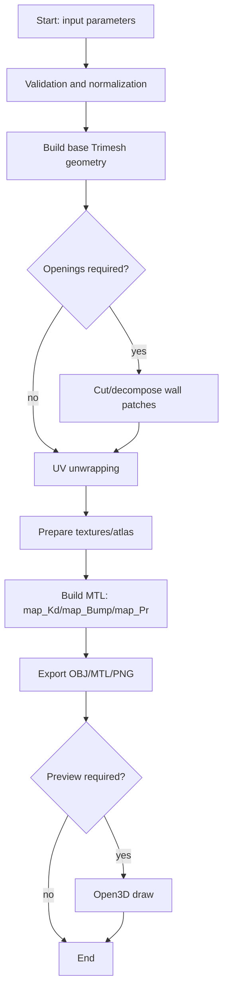
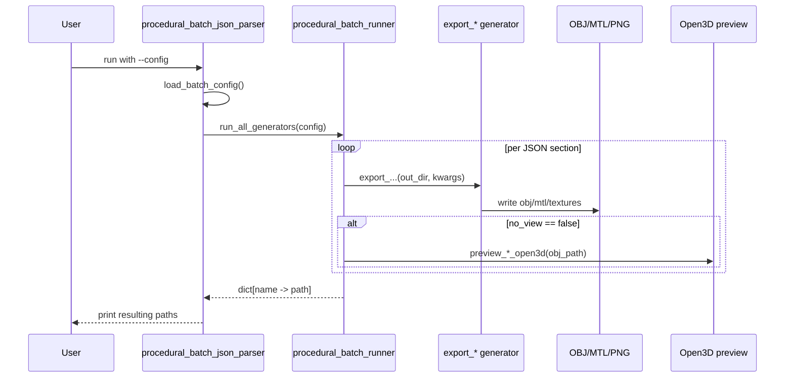

# Процедурний генератор 3D-об'єктів фасаду

## 1. Призначення модуля

Каталог `src/generator/procedural` реалізує параметричну генерацію 3D-моделей архітектурних елементів будівлі:
- вікно (`procedural_window.py`);
- стіна (`procedural_wall.py`, `procedural_wall_mesh.py`);
- стіна з вікном (`procedural_wall_window.py`);
- під'їзд (`procedural_entrance.py`);
- балкон/лоджія (`procedural_balcony.py`);
- пакетний запуск усіх генераторів через JSON (`procedural_batch_json_parser.py`, `procedural_batch_runner.py`).

Результат роботи генераторів: експорт `OBJ/MTL` і набору текстур (albedo/diffuse, normal, roughness), а також опціональний інтерактивний перегляд в Open3D (`open3d_preview.py`).

---

## 2. Загальна архітектура



Ідея архітектури: відокремити етапи **геометрії**, **UV**, **матеріалів/текстур** і **експорту**, щоб код було зручно перевикористовувати між різними типами об'єктів.

---

## 3. Опис основних модулів

### 3.1 `procedural_window.py`

Формує вікно з двох компонентів:
- рама (`frame`);
- скло (`glass`).

Підтримує профілі:
- `rect` (прямокутне),
- `arch` (аркове),
- `round` (кругле).

Підтримує розкладки:
- `fixed`, `double_hung`, `casement`, `french`,
- явну сітку імпостів (`mullions_vertical`, `mullions_horizontal`),
- часткові горизонтальні перемички (`partial_horizontal_bars`).

Ключові функції:
- `resolve_window_frame_glass_params(...)` — нормалізація та валідація параметрів;
- `build_window_frame_glass_meshes(...)` — генерація геометрії рами та скла;
- `frame_glass_atlas_uv_mesh(...)` (з `unfolding`) — UV в атлас вікна;
- `export_window_demo(...)` — повний експорт;
- `preview_windows_open3d(...)` — попередній перегляд.

### 3.2 `procedural_wall_mesh.py` + `procedural_wall.py`

- `build_solid_wall_mesh(...)` — суцільна стіна.
- `build_wall_mesh_rect_opening(...)` — стіна з прямокутним прорізом (використовується у стіні з вікном).
- `export_wall(...)` — експорт геометрії стіни та матеріалів.

Особливість: проріз формується вручну через набір чотирикутників/трикутників, що дає передбачувану топологію та нормалі.

### 3.3 `procedural_wall_window.py`

Збирає комбінований об'єкт:
- окремо стіну,
- окремо вікно,
- позиціонує вікно за `window_center_x` і `window_sill_z`,
- вирізає проріз у стіні за AABB рами вікна,
- об'єднує та експортує в єдиний `wall_window.obj`.

Ключова структура:
- `WallWindowBuild` (dataclass): `wall`, `window_frame`, `window_glass`, `window_mesh`, `window_uv`.

### 3.4 `procedural_entrance.py`

Реалізує 2 сценарії:
- `canopy` — варіант із козирком;
- `niche` — варіант із заглибленою нішею/тамбуром.

Є підтримка дверей (зокрема двостулкових) через `procedural_door.py`, а також текстурований експорт через атлас (`entrance_atlas.py`).

### 3.5 `procedural_balcony.py`

Найбільш насичений за параметрами генератор:
- трапецієподібна або прямокутна геометрія плану;
- парапет, верхня зона, бічні стіни;
- режими вікон/прорізів;
- вікна/двері на внутрішній стіні;
- атлас матеріалів на 7 плиток (низ, верх, рама, скло та ін.).

### 3.6 Batch-шар

- `procedural_batch_json_parser.py` — читає JSON і запускає пакетну генерацію;
- `procedural_batch_runner.py` — оркеструє виклики `export_*` функцій усіх модулів;
- вміє перетворювати вкладений JSON-блок `texture` в аргументи конкретного генератора.

---

## 4. Схема взаємодії модулів (UML Component)



---

## 5. Діаграми класів (UML Class Diagrams)

У каталозі `procedural` визначено 2 основні користувацькі класи (`dataclass`): `WindowFrameGlassParams` і `WallWindowBuild`. Нижче наведено діаграми для обох класів та їхнього використання в ключових модулях.

### 5.1 Main domain classes



### 5.2 Window module class usage



### 5.3 Wall+Window module class usage



### 5.4 Entrance and Balcony pseudo-class view



Примітка: це UML-подання на рівні архітектури (module-as-class). У реалізації `procedural_entrance.py` і `procedural_balcony.py` використано функціональний стиль, тобто без явних Python `class`.

---

## 6. Алгоритм генерації (блок-схема)



---

## 7. Послідовність для batch-режиму (UML Sequence)



---

## 8. Формати даних і вихідні артефакти

Вихід кожного генератора зазвичай містить:
- `*.obj` — геометрія;
- `*.mtl` — опис матеріалів;
- `*.png` — текстури:
  - `map_Kd` (albedo/diffuse),
  - `map_Bump`/`bump` (normal map, через `-bm`),
  - `map_Pr` (roughness, розширення для PBR-імпортерів).

Параметри можуть надходити:
- з CLI (`argparse`);
- з JSON (batch);
- частково з дефолтних словників `USER_*` всередині модулів.

### 8.1 Як працює текстурний пайплайн

У проєкті використано комбінований підхід до текстур:
- **зовнішні карти** (коли користувач передає власні PNG/JPG);
- **процедурні карти** (коли текстури не задані вручну або потрібен швидкий дефолт).

Ключові кроки пайплайна:
1. Формується геометрія об'єкта та UV-розгортка.
2. Обирається джерело текстур (файл користувача або процедурна генерація).
3. Для вікон/під'їзду створюється **атлас** (кілька матеріальних зон в одному зображенні).
4. За потреби генеруються похідні PBR-карти: `normal` і `roughness`.
5. У `MTL` прописуються посилання на карти (`map_Kd`, `map_Bump`/`bump`, `map_Pr`).

### 8.2 Атласи та їхня логіка

#### Вікно (`window_texture_assets.py`)

Для вікна застосовується atlas-підхід:
- ліва половина атласу — **рама**;
- права половина — **скло**.

Це дозволяє:
- зберегти один `map_Kd` у `OBJ/MTL`;
- мати різні матеріальні властивості частин вікна без окремих mesh-матеріалів;
- спростити експорт та сумісність з переглядачами.

Для normal/roughness використовується аналогічна розкладка по тих самих UV-координатах, тому всі карти узгоджені між собою.

#### Під'їзд і балкон

Для під'їзду і балкона також застосовуються тайлові атласи:
- різні зони (стіна, дах, двері, рама, скло тощо) мають окремі тайли;
- UV конкретного патча масштабується у відповідний тайл;
- це дає контрольований вигляд складних об'єктів при мінімальній кількості матеріалів.

### 8.3 Генерація normal map і roughness map

#### `pbr_map_utils.py`

`make_normal_map_from_albedo(...)`:
- переводить albedo в градації сірого;
- обчислює градієнти яскравості по X/Y;
- формує нормалі в tangent-space;
- пакує їх у RGB normal map.

`make_roughness_map_from_albedo(...)`:
- бере нормалізовану яскравість albedo;
- відображає її в діапазон шорсткості `[min_roughness, max_roughness]`;
- зберігає у grayscale RGB-карту для сумісності.

Практичний сенс:
- `normal` додає дрібний рельєф без збільшення полігонів;
- `roughness` керує "матовістю/глянцем" поверхні.

### 8.4 Процедурні текстурні сімейства

У `surface_texture_assets.py` реалізовані готові "сімейства" матеріалів:
- rough wall;
- cracked wall;
- plaster wall;
- roof shingles;
- ceramic tiles.

Кожне сімейство генерує одразу **триплет карт**:
- `*_albedo.png`,
- `*_normal.png`,
- `*_roughness.png`.

В основі генерації:
- фрактальний шум;
- згладження та локальні варіації;
- перетворення "висотної" карти у normal map.

Це забезпечує варіативність текстур без ручного малювання для кожного кейсу.

### 8.5 Тонування та адаптація користувацьких текстур

У модулі `color_tint.py` підтримано параметричне тонування (`frame_texture_color`, `glass_texture_color`, `wall_texture_color`):
- можна змінити відтінок базової текстури без створення нових файлів;
- одна й та сама карта перевикористовується в різних стилях фасаду.

Додатково для скла використано механізм підвищення видимості занадто темних текстур (`_boost_dark_glass_visible`), щоб у preview та на світлому фоні матеріал не "зникав".

### 8.6 Як текстури пов'язані з MTL

У фінальному `MTL` зазвичай фігурують такі записи:
- `map_Kd` — базовий колір (albedo/diffuse);
- `map_Bump` та/або `bump` (+ `-bm`) — normal/bump ефект;
- `map_Pr` — roughness (де підтримується імпортером).

Отже, текстурна підсистема напряму керує не лише кольором, а й сприйняттям мікрорельєфу та блиску матеріалу в рендері.

---

## 9. Роль підпакетів

### `texturing/`
- генерація процедурних текстур і атласів (`window_texture_assets.py`, `surface_texture_assets.py`);
- генерація normal/roughness (`pbr_map_utils.py`);
- тонування текстур (`color_tint.py`);
- експорт OBJ/MTL для комбінованих об'єктів (`wall_window_obj_export.py`);
- атлас для під'їзду (`entrance_atlas.py`).

### `unfolding/`
- алгоритми UV-розгортки:
  - `faceted_uv.py` — фасетний/трипланарний підхід;
  - `wall_triplanar.py` — розгортка стін.

### `procedural_texture_maps/`
- генерація карт кольору та нормалей повністю процедурно (noise, штукатурка, дерево, матове скло тощо).

---

## 10. Переваги поточного підходу

- Параметричність: один код покриває багато варіантів фасадних елементів.
- Модульність: геометрія, UV, матеріали й preview розділені за відповідальністю.
- Сумісність: експорт у поширений формат `OBJ/MTL`.
- Автоматизація: batch-режим дозволяє масово генерувати датасети варіантів.
- Розширюваність: нові типи об'єктів підключаються через єдиний патерн `build_*` + `export_*`.

---

## 11. Приклади запуску (для тексту диплома)

```bash
# Window
python -m src.generator.procedural.procedural_window export -o data/window_export

# Wall + window
python -m src.generator.procedural.procedural_wall_window export -o data/wall_window_export

# Entrance (niche)
python -m src.generator.procedural.procedural_entrance export --style niche -o data/entrance_niche

# Balcony
python -m src.generator.procedural.procedural_balcony export -o data/balcony_export

# Batch from JSON
python -m src.generator.procedural.procedural_batch_json_parser --config scripts/balcony_examples/batch_generators_config.json
```

---

## 12. Що можна додати в диплом як розвиток

- експорт у glTF/GLB з PBR-матеріалами;
- генерація LOD-версій моделей;
- параметрична бібліотека стильових пресетів (серії будинків);
- модуль автоматичного розміщення об'єктів на фасаді за правилами;
- unit/visual regression тести на стабільність геометрії та UV.

